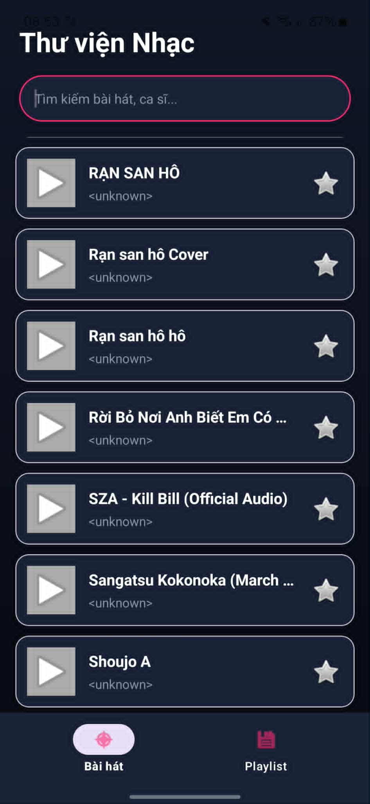
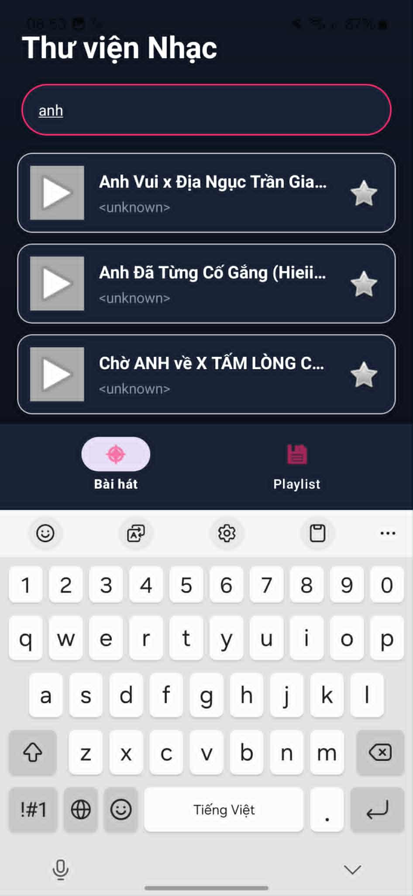

# OffMusic

Ứng dụng nghe nhạc **offline** Android Native — quản lý thư viện nhạc, tìm kiếm, đánh dấu yêu thích và tạo danh sách phát cá nhân ngay trên thiết bị.

## Công nghệ sử dụng

| Công nghệ | Mức độ |
|---|---|
| **Kotlin** | Ngôn ngữ lập trình chính |
| **Android SDK** | Phát triển ứng dụng Android Native |
| **Material Design** | Giao diện theo chuẩn Material Design của Google |
| **MVVM Architecture** | Kiến trúc Model - View - ViewModel |
| **Room Database** | ORM trên SQLite, lưu trữ local |
| **Kotlin Coroutines + Flow** | Xử lý bất đồng bộ và phát luồng dữ liệu |
| **ViewBinding** | Liên kết view an toàn kiểu |
| **Media3 ExoPlayer** | Engine phát nhạc |
| **MediaStore** | API hệ thống quét tệp nhạc |

## Mô tả

- Đọc toàn bộ tệp nhạc trên thiết bị qua `MediaStore` API.
- Phát nhạc trực tiếp bằng **ExoPlayer / Media3**.
- Quản lý thư viện nhạc với tìm kiếm theo tên bài hát và nghệ sĩ.
- Đánh dấu bài hát **yêu thích**.
- Tạo và quản lý **Playlist cá nhân**, thêm/xóa bài hát vào danh sách phát.

## Màn hình ứng dụng

| Giao diện | Mô tả |
|---|---|
| Ảnh 1 | Màn hình danh sách bài hát |
| Ảnh 2 | Màn hình chi tiết từng bài hát |
| Ảnh 3 | Màn hình tìm kiếm bài hát |
| Ảnh 4 | Màn hình danh sách Playlist |